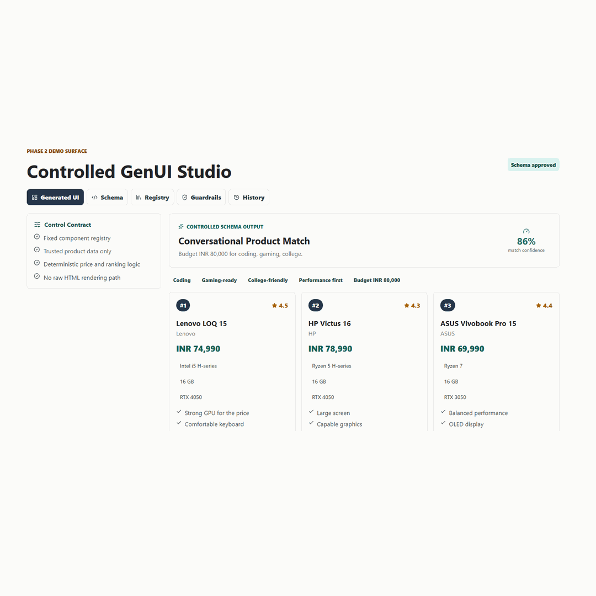

# Controlled GenUI Product Finder

[](https://github.com/mastermohit/controlled-genui/actions/workflows/ci.yml)

A demo project that showcases the **Controlled** pillar of Generative UI.

Instead of allowing an AI model to generate arbitrary HTML, this app treats the model as a planner. The generated output is a strict JSON schema, and the frontend can only render components from a fixed registry.



Live demo: [controlled-genui.vercel.app](https://controlled-genui.vercel.app)

## Demo Story

The user asks for a laptop recommendation in natural language:

```txt
Find me a laptop for coding, gaming, and college under INR 80,000
```

The system turns that prompt into a controlled schema:

```txt
Prompt
-> generator
-> JSON schema
-> validator
-> approved component registry
-> React renderer
```

The UI feels generated, but the system remains predictable, testable, and safe.

## Phase 2 Features

- Controlled product recommendation UI
- Strict component registry
- Schema validation panel
- Guardrails view with allowed and blocked behavior
- Registry explorer for approved UI blocks
- Rejected schema simulation for `raw_html`
- Prompt history and replay
- Product detail drawer driven by trusted product ids
- GitHub and LinkedIn-ready documentation

## Phase 3 Features

- Optional real LLM schema generation through `/api/generate-schema`
- OpenAI Responses API Structured Outputs
- Zod runtime validation before rendering
- Mock/LLM mode switch
- Model Output tab showing raw model output, validation, and fallback status
- Safe fallback to deterministic mock generation when no API key is configured

## Phase 4 Features

- Vitest coverage for generator, schema, and catalog guardrails
- Playwright browser smoke tests for the demo flow
- Local verification command with `npm run verify`
- GitHub Actions CI for every push and pull request
- Testing documentation for the Controlled GenUI contract
- Persistent generated history in `localStorage`
- Shareable demo links with `prompt` and `mode` query params
- Copy/export controls for generated schemas
- Guided Demo Script tab for walkthroughs
- Schema Inspector for component-level registry and prop checks
- Schema comparison notes in Model Output
- Multiple rejected-schema examples

## Controlled GenUI Principles

This project follows four rules:

1. The generator returns JSON, not HTML.
2. The renderer only supports approved component types.
3. Business logic such as ranking and pricing stays deterministic.
4. Unknown or unsafe component types are rejected before render.

## Component Registry

Approved components:

- `intent_summary`
- `filter_chips`
- `recommendation_cards`
- `comparison_table`
- `insight_panel`
- `no_results`
- `next_steps`

If a schema tries to use something like `raw_html`, the validator rejects it and the renderer has no path for it.

## Product Catalog Behavior

Products are intentionally static and trusted. The LLM can choose from product IDs in `src/data/products.ts`, but it cannot invent new laptops, prices, or specs.

If a prompt asks for a laptop below the trusted catalog range, such as:

```txt
Find a laptop for coding under INR 20,000
```

the app shows a controlled `no_results` state instead of pretending that one of the existing laptops matches.

This is part of the Controlled GenUI contract: adaptive UI, but grounded in known data.

## Share Demo States

The studio can open directly from a prompt and generation mode:

```txt
/?prompt=Find+a+laptop+for+coding+under+80000&mode=llm
```

Use **Copy Demo Link** to copy the current prompt and mode as a shareable URL.

Use **Copy Schema** or **Export Schema** to share the generated JSON contract behind the UI.

Generated history is saved to `localStorage`, so refreshing the demo does not wipe prior runs.

Use **Demo Script** during a recording or live walkthrough. It steps through the generated UI, schema contract, rejected examples, schema comparison, and shareable demo link.

Use **Inspector** to explain each generated component: registry status, renderer path, allowed props, received props, and trusted product ID resolution.

## Tech Stack

- React
- TypeScript
- Vite
- Lucide React icons

## Run Locally

For the frontend-only mock demo:

```powershell
npm install
npm run dev -- --port 5173
```

Open:

```txt
http://127.0.0.1:5173
```

This starts Vite only. In this mode, the `/api/generate-schema` serverless route is not available, so **LLM mode will fall back to the mock generator**.

## Build

```powershell
npm run build
```

## Test

```powershell
npm test
```

Run tests and production build together:

```powershell
npm run verify
```

Run browser smoke tests:

```powershell
npm run test:e2e
```

More detail: [docs/TESTING.md](docs/TESTING.md)

## Enable LLM Mode

Create a `.env.local` file:

```txt
OPENAI_API_KEY=your_openai_api_key_here
OPENAI_MODEL=gpt-4o-mini
RATE_LIMIT_WINDOW_MS=60000
RATE_LIMIT_MAX_REQUESTS=5
MAX_PROMPT_LENGTH=500
```

Then run the app with Vercel's local runtime instead of plain Vite:

```powershell
npm install -g vercel
vercel dev
```

Open the URL printed by `vercel dev`, usually:

```txt
http://localhost:3000
```

Why this matters:

- `npm run dev` runs only the Vite frontend.
- `vercel dev` runs both the Vite frontend and the `/api/generate-schema` serverless function.
- LLM mode needs the serverless function so it can safely call OpenAI without exposing your API key in the browser.

On Vercel, add the same environment variables in Project Settings.

The app still works without these variables. If the API key is missing or the model returns invalid data, the UI falls back to the deterministic mock generator.

## Rate Limiting

The LLM endpoint has a server-side per-IP rate limit before it calls OpenAI.

Default limits:

```txt
RATE_LIMIT_WINDOW_MS=60000
RATE_LIMIT_MAX_REQUESTS=5
MAX_PROMPT_LENGTH=500
```

That means each IP can make 5 LLM generation requests per 60 seconds, and prompts longer than 500 characters are rejected.

The endpoint returns these headers:

```txt
X-RateLimit-Limit
X-RateLimit-Remaining
X-RateLimit-Reset
Retry-After
```

This implementation uses an in-memory store, which is enough for a portfolio/demo app. For production-grade abuse protection across multiple serverless regions, use a shared store such as Upstash Redis, Vercel KV, or another managed rate-limit service.

To confirm which path ran, open the **Model Output** tab:

- `Live LLM schema` means OpenAI returned a schema and Zod accepted it.
- `Fallback schema` means the API route failed, no API key was available, or validation failed.
- `Mock generator` means the app was intentionally run in Mock mode.

## Project Structure

```txt
src/
  App.tsx                         Studio shell and demo flows
  generator.ts                    Prompt-to-schema mock generator
  schema.ts                       Registry and validation logic
  structuredSchema.ts             Zod and JSON Schema contract
  llmGenerator.ts                 Client-side LLM/fallback adapter
  types.ts                        Controlled schema types
api/
  generate-schema.ts              Vercel serverless OpenAI endpoint
  components/
    ControlledRenderer.tsx        Approved component renderer
  data/
    products.ts                   Trusted product catalog
```

## Demo Script

1. Start on the Generated UI tab.
2. Enter a product prompt and click Generate.
3. Show that the generated product cards, comparison table, and insight panel change.
4. Open the Schema tab and explain that the UI came from JSON.
5. Toggle rejected schema examples and show raw HTML, remote components, and fake product objects being blocked.
6. Open Inspector and explain how each component is approved and rendered.
7. Open the Registry tab and show the approved component list.
8. Open Guardrails and explain what the generator can and cannot do.
9. Open Model Output and show how the schema compares with the deterministic baseline.
10. Open a product detail drawer and explain that details come from trusted product ids.

## Future Phase Ideas

- Replace the mock generator with a real LLM call.
- Add a Zod schema for runtime prop validation.
- Save history to local storage.
- Add follow-up question blocks for vague prompts.
- Add unit tests for schema validation and ranking.
